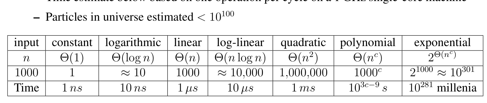
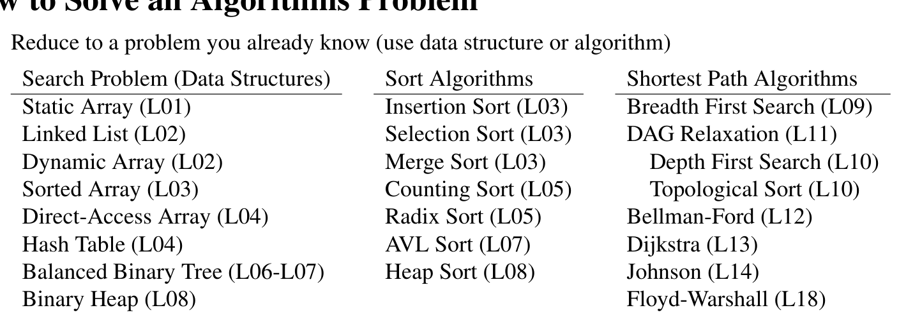

# mit-6.006-lecture-01

### Lecture 1: Introduction

The goal of this class is to teach you to solve computation problems, and to communicate that your solutions are correct and efficient.

### Problem

• Binary relation from problem inputs to correct outputs

• Usually don’t specify every correct output for all inputs (too many!)

• Provide a verifiable predicate (a property) that correct outputs must satisfy

• 6.006 studies problems on large general input spaces

• Not general: small input instance

– Example: In this room, is there a pair of students with same birthday?

• General: arbitrarily large inputs

– Example: Given any set of n students, is there a pair of students with same birthday?

– If birthday is just one of 365, for n > 365, answer always true by pigeon-hole

– Assume resolution of possible birthdays exceeds n (include year, time, etc.)

### Algorithm

• Procedure mapping each input to a single output (deterministic)

• Algorithm solves a problem if it returns a correct output for every problem input

• Example: An algorithm to solve birthday matching

– Maintain a record of names and birthdays (initially empty)

– Interview each student in some order

∗ If birthday exists in record, return found pair!

∗ Else add name and birthday to record

– Return None if last student interviewed without success

### Correctness

• Programs/algorithms have fixed size, so how to prove correct?

• For small inputs, can use case analysis

• For arbitrarily large inputs, algorithm must be recursive or loop in some way

• Must use induction (why recursion is such a key concept in computer science)

• Example: Proof of correctness of birthday matching algorithm

– Induct on k: the number of students in record

– Hypothesis: if first k contain match, returns match before interviewing student k + 1

– Base case: k = 0, first k contains no match

– Assume for induction hypothesis holds for k = k ^ { \prime } , and consider k = k ^ { \prime } + 1

– If first k0 contains a match, already returned a match by induction

– Else first k0 do not have match, so if first k ^ { \prime } + 1 has match, match contains k ^ { \prime } + 1

– Then algorithm checks directly whether birthday of student k ^ { \prime } + 1 exists in first k ^ { \prime } \mod

### Efficiency

• How fast does an algorithm produce a correct output?

– Could measure time, but want performance to be machine independent

– Idea! Count number of fixed-time operations algorithm takes to return

– Expect to depend on size of input: larger input suggests longer time

– Size of input is often called ‘n’, but not always!

– Efficient if returns in polynomial time with respect to input

– Sometimes no efficient algorithm exists for a problem! (See L20)

• Asymptotic Notation: ignore constant factors and low order terms

– Upper bounds (O), lower bounds (Ω), tight bounds (Θ) ∈, =, is, order

– Time estimate below based on one operation per cycle on a 1 GHz single-core machine

– Particles in universe estimated < 1 0 ^ { 1 0 0 }

### Table 1. Table 1



- Table ID: `table-001`
- Source page: 2
- Metadata: [table-001.json](tables/table-001.json)
- Structured data status: `not_extracted`

### Model of Computation

• Specification for what operations on the machine can be performed in O(1) time

• Model in this class is called the Word-RAM

• Machine word: block of w bits (w is word size of a w-bit Word-RAM)

• Memory: Addressable sequence of machine words

• Processor supports many constant time operations on a O(1) number of words (integers):

– integer arithmetic: ( + , - , \mathrm { ~ \bf ~ \epsilon ~ } , \mathrm { ~ \bf ~ \zeta ~ } / , \mathrm { ~ \bf ~ \frac { ~ \sf ~ o ~ } { ~ \sf ~ o ~ } ~ } )

– logical operators: ( \delta \delta , \mathrm { ~ ~ { ~ \pi ~ } ~ } | | , \mathrm { ~ ~ { ~ \pi ~ } ~ } ! , \mathrm { ~ ~ { ~ \psi ~ } ~ } = - , \mathrm { ~ ~ { ~ \cal { < } } ~ } , \mathrm { ~ ~ { ~ \pi ~ } ~ } > , \mathrm { ~ ~ { ~ \zeta ~ } ~ } < = , \mathrm { ~ ~ { ~ \pi ~ } ~ } = > )

– (bitwise arithmetic: ( \updownarrow , | , < < , > , \cdot . . . ) \big )

– Given word a, can read word at address a, write word to address a

• Memory address must be able to access every place in memory

– Requirement: w \geq \# bits to represent largest memory address, i.e., \log _ { 2 } n

– 32-bit words → max ∼ 4 GB memory, 64-bit words → max ∼ 16 exabytes of memory

• Python is a more complicated model of computation, implemented on a Word-RAM

### Data Structure

• A data structure is a way to store non-constant data, that supports a set of operations

• A collection of operations is called an interface

– Sequence: Extrinsic order to items (first, last, nth)

– Set: Intrinsic order to items (queries based on item keys)

• Data structures may implement the same interface with different performance

• Example: Static Array - fixed width slots, fixed length, static sequence interface

- \mathsf { \cot { a } { \ t { a } \ t { a } \ t r { \pm } \mathsf { a } \ y ( \mathsf { n } ) } } : allocate static array of size n initialized to 0 in \Theta ( n ) time

- \cot \tt a t i c a r r a y . s e t \_ a t ( i ) : return word stored at array index i in Θ(1) time

\texttt { - S t a t i c R r c a y . s e t \_ a t ( i , \ x ) } : write word x to array index i in Θ(1) time

• Stored word can hold the address of a larger object

• Like Python tuple plus \mathsf { s e t \mathrm { \_ a t } } \mathsf { \Lambda } ( \mathrm { i } , \mathrm { \Omega } \times \mathsf { ) } , Python list is a dynamic array (see L02)

```
def birthday_match(students): ’’’ 2 3 Find a pair of students with the same birthday 4 Input: tuple of student (name, bday) tuples 5 Output: tuple of student names or None 6 ’’’ 7 n = len(students) # O(1) 8 record = StaticArray(n) # O(n) 9 for k in range(n): # n 10 (name1, bday1) = students[k] # O(1) 11 # Return pair if bday1 in record 12 for i in range(k): # k 13 (name2, bday2) = record.get_at(i) # O(1) 14 if bday1 == bday2: # O(1) 15 return (name1, name2) # O(1) 16 record.set_at(k, (name1, bday1)) # O(1) 17 return None # O(1)
```

### Example: Running Time Analysis

• Two loops: outer k \in \{ 0 , \ldots , n - 1 \} , inner is i \in \{ 0 , \ldots , k \}

• Running time is \begin{array} { r } { O ( n ) + \sum _ { k = 0 } ^ { n - 1 } ( O ( 1 ) + k \cdot O ( 1 ) ) = O ( n ^ { 2 } ) } \end{array}

• Quadratic in n is polynomial. Efficient? Use different data structure for record!

### How to Solve an Algorithms Problem

1. Reduce to a problem you already know (use data structure or algorithm)

### Table 2. Table 2



- Table ID: `table-002`
- Source page: 4
- Metadata: [table-002.json](tables/table-002.json)
- Structured data status: `not_extracted`

## 2. Design your own (recursive) algorithm

• Brute Force

• Decrease and Conquer

• Divide and Conquer

• Dynamic Programming (L15-L19)

• Greedy / Incremental

6.006 Introduction to Algorithms Spring 2020

For information about citing these materials or our Terms of Use, visit: https://ocw.mit.edu/terms
